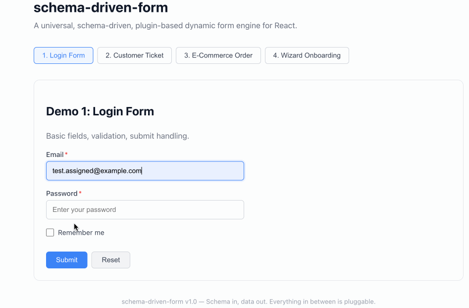

# schema-driven-form

A universal, schema-driven, plugin-based dynamic form engine for React.

**Schema in, data out. Everything in between is pluggable.**

**<a href="https://schema-driven-form-2iiw.vercel.app" target="_blank">Live Demo</a>**



## Features

- **Schema-driven** — Define your form with a JSON object, get a fully functional UI
- **20+ built-in field types** — text, number, select, date, upload, cascader, and more
- **Dependency system** — Cascading selects, conditional fields, computed values, dynamic validation
- **Validation** — Sync + async, field-level + form-level, built-in rules + custom validators
- **Wizard mode** — Multi-step forms with step validation and conditional steps
- **Field arrays** — Dynamic repeatable rows with add/remove/reorder
- **Fully extensible** — Custom fields, middleware, plugins, validators, effects, layouts
- **UI-agnostic** — Replace all default components with Ant Design, MUI, Chakra, or anything
- **TypeScript** — Complete type definitions

## Quick Start

```bash
git clone https://github.com/cindyzhu/schema-driven-form.git
cd schema-driven-form
npm install
npm run dev
```

## Basic Usage

```tsx
import { DynamicForm } from './DynamicForm';
import type { FormSchema } from './types';

const schema: FormSchema = {
  fields: [
    {
      name: 'email',
      type: 'email',
      label: 'Email',
      required: true,
      rules: [{ type: 'email' }],
    },
    {
      name: 'password',
      type: 'password',
      label: 'Password',
      required: true,
      rules: [{ type: 'minLength', value: 8 }],
    },
  ],
};

function App() {
  return (
    <DynamicForm
      schema={schema}
      onSubmit={(output) => console.log(output.values)}
    />
  );
}
```

## Field Types

| Type | Description | Value |
|------|-------------|-------|
| `text` `email` `url` `phone` `password` | Text inputs | `string` |
| `number` | Number input | `number` |
| `textarea` | Multi-line text | `string` |
| `select` / `multiSelect` | Dropdown select | `any` / `any[]` |
| `radio` | Radio group | `any` |
| `checkbox` / `checkboxGroup` | Checkbox | `boolean` / `any[]` |
| `switch` | Toggle switch | `boolean` |
| `date` `time` `datetime` `dateRange` | Date/time pickers | `string` / `[string, string]` |
| `slider` | Range slider | `number` |
| `rate` | Star rating | `number` |
| `upload` | File upload (drag & drop) | `FileInfo[]` |
| `colorPicker` | Color picker | `string` |
| `cascader` | Multi-level linked selects | `any[]` |
| `fieldArray` | Dynamic repeatable rows | `object[]` |
| `fieldGroup` | Nested object group | `object` |

## Key Concepts

### Conditional Fields

```typescript
// Show field only when contactMethod is 'phone'
{ name: 'phone', type: 'text', when: { field: 'contactMethod', value: 'phone' } }
```

### Cascading Dependencies

```typescript
{
  name: 'subCategory',
  type: 'select',
  effects: [
    { watch: 'category', action: 'setOptions', compute: (cat) => OPTIONS[cat] ?? [] },
    { watch: 'category', action: 'setValue', compute: () => undefined },
  ],
}
```

### Wizard Mode

```typescript
const schema: FormSchema = {
  steps: [
    { id: 'step1', title: 'Personal', fieldNames: ['name', 'email'] },
    { id: 'step2', title: 'Details', fieldNames: ['bio', 'avatar'] },
    { id: 'step3', title: 'Confirm', fieldNames: ['agreement'] },
  ],
  fields: [ /* ... */ ],
};
```

### Custom Field Components

Swap in your own UI library (Ant Design, MUI, Chakra, etc.):

```tsx
<DynamicForm
  schema={schema}
  fieldComponents={{ text: MyCustomTextInput, select: MyCustomSelect }}
/>
```

## Demos

Run `npm run dev` to see 4 live demos:

| Demo | What it shows |
|------|---------------|
| **Login Form** | Basic fields, validation, submit |
| **Customer Service Ticket** | Cascading deps, conditional fields, dynamic validation, auto-fill |
| **E-Commerce Order** | Field arrays, field groups, sections, conditional billing |
| **Wizard Onboarding** | Multi-step, conditional steps, all 20+ field types |

## Documentation

- [API Reference](./docs/api-reference.md) — Full schema, field types, validation, effects, engine methods
- [Architecture](./ARCHITECTURE.md) — System design, core engine, extension points, data flow

## Tech Stack

- **React 19** + **TypeScript 5.9** + **Vite 7**
- Zero external UI dependencies
- Core engine has zero React dependency (portable)

## License

[MIT](./LICENSE)
